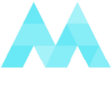

<a name="readme-top"></a>

<!-- PROJECT LOGO -->
<br />
<div align="center">
  
</a>

<h3 align="center">The Minimal Silly Programming Language</h3>

  <p align="center">
    MSPL (Minimal Silly Programming Language) is an interpreted programming language.
    <br />
    <a href="https://github.com/github_username/repo_name"><strong>Explore the docs »</strong></a>
    <br />
    <br />
  </p>
</div>


<!-- ABOUT THE PROJECT -->
<h2 align="center">About The Project</h2>

<p align="center">Minimal Silly Programming Language is a interpreted programming language, with the interpreter written in Python. This is currently a side project.</p>


### Built With:
 


<!-- GETTING STARTED -->
## Getting Started

This is an example of how you may give instructions on setting up your project locally.
To get a local copy up and running follow these simple example steps.

### Installation

1. Ensure you have Python v3.11 installed on your machine.
2. Clone the repository, the project does rely on the following libraries:
- Colorama -> ```pip install colorama```

##  ```Warning``` : the interpreter is nowhere near ready to be used, many bugs currently exist, as it's very early into development.


### Using the Interpreter

1. Create a file in ```src/tests``` with an extension name of ```mspl```.
2. Head into ```src/MSPL.py``` and change the ```TestCase``` variable to your mspl file's name.
3. Run MSPL eg. ```python src/MSPL.py```


<!-- USAGE EXAMPLES -->
## Usage
   ```js
   print("Hello World!");
   
   let LanguageName = "MSPL";
   print("Welcome to " + LanguageName);

   ```

_For more examples, please refer to the ```tests``` directory._


<!-- CONTRIBUTING -->
## Contributing

Contributions are what make the open source community such an amazing place to learn, inspire, and create. Any contributions you make are **greatly appreciated**.

If you have a suggestion that would make this better, please fork the repo and create a pull request. You can also simply open an issue with the tag "enhancement".
Don't forget to give the project a star! Thanks again!

1. Fork the Project
2. Create your Feature Branch (`git checkout -b feature/AmazingFeature`)
3. Commit your Changes (`git commit -m 'Add some AmazingFeature'`)
4. Push to the Branch (`git push origin feature/AmazingFeature`)
5. Open a Pull Request


<!-- LICENSE -->
## License

Distributed under the MIT License. See `LICENSE.txt` for more information.


<!-- CONTACT -->
## Contact

waetrmelon - @waetrmelon on GitHub & Discord.


<p align="right">(<a href="#readme-top">back to top</a>)</p>
   
